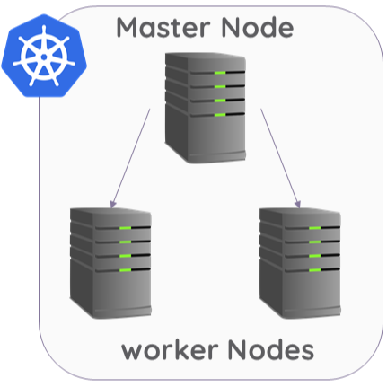

# K8s Setting Docs for HOBIT


<p align="left">

</p>

* Our Server spec (Scouter1,2,3)

| | |
|-|-|
| OS | Ubuntu 20.04.6 LTS (Focal Fossa) |
| CPU | Intel Core i7-10700K 3.80GHz |
| RAM | 64GB DDR4, 3200 MT/s, 16GB x 4 |


## Getting Start
1. Master 노드에서
    ```
    curl -sfL https://get.k3s.io | sh -
    ```
    명령어 후 다음과 같이 출력
    ```
    [INFO]  Finding release for channel stable
    [INFO]  Using v1.26.4+k3s1 as release
    [INFO]  Downloading hash https://github.com/k3s-io/k3s/releases/download/v1.26.4+k3s1/sha256sum-amd64.txt
    . . .
    [INFO]  systemd: Starting k3s
    ```
2. Master 노드에서 환경변수 설정
    ```
    mkdir ~/.kube

    sudo cp /etc/rancher/k3s/k3s.yaml ~/.kube/config

    sudo chown -R $(id -u):$(id -g) ~/.kube

    echo "export KUBECONFIG=~/.kube/config" >> ~/.bashrc

    source ~/.bashrc
    ```
3. Worker노드가 클러스터에 가입하기 위한 토큰을 확인
    ```
    NODE_TOKEN=$(sudo cat /var/lib/rancher/k3s/server/node-token)

    echo $NODE_TOKEN
    ```
4. Worker노드에서 master서버주소, 토큰을 같이 입력하고 실행

    >_<master_ip>, <token>에 각각 master 노드의 주소와 토큰을 입력_
    ```
    curl -sfL https://get.k3s.io | K3S_URL=https://<master_ip>:6443 K3S_TOKEN=<token> sh -
    ```
5. Done
    ```
    kubectl get nodes 
    ```

## 노드 라벨 설정

1. Kubernetes 클러스터의 각 노드에 `topology.kubernetes.io/zone` 라벨을 설정하여 `nodeAffinity`를 사용할 수 있습니다. 

    아래 명령어들은 각 노드에 특정 zone 라벨을 추가하는 예시입니다.

    ```sh
    # node1에 zone-1 라벨 추가
    kubectl label nodes <node1_name> topology.kubernetes.io/zone=zone-1

    # node2에 zone-2 라벨 추가
    kubectl label nodes <node2_name> topology.kubernetes.io/zone=zone-2

    # node3에 zone-3 라벨 추가
    kubectl label nodes <node3_name> topology.kubernetes.io/zone=zone-3
    ```

2. 노드 라벨 설정 확인

    각 노드에 라벨이 올바르게 설정되었는지 확인하려면 다음 명령어를 사용합니다:

    ```sh
    kubectl get nodes --show-labels
    ```